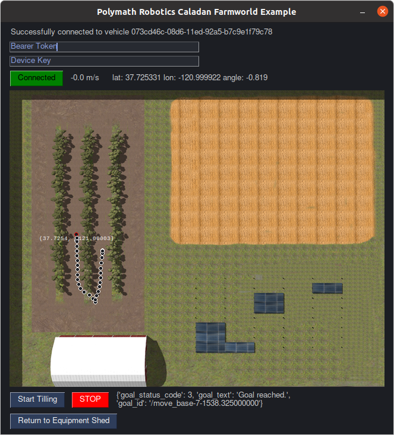
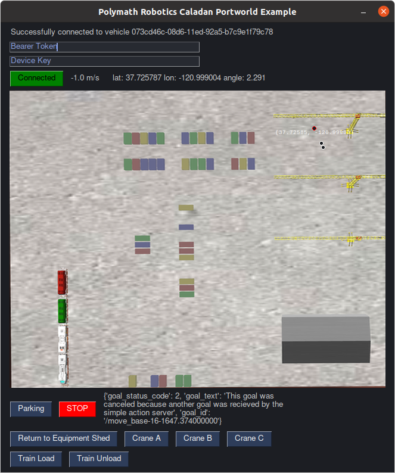

# caladan_examples [](https://github.com/polymathrobotics/caladan_examples/actions/workflows/ci.yml)

See your robot moving autonomously in simulation - today!

## Requirements

1. Python3
2. Pip3  
  
Once you have both of the above installed, you can go to the installation section below to pull down requirements.  
These are python libraries [Requests](https://pypi.org/project/requests/) and [PySimpleGUI](https://pypi.org/project/PySimpleGUI/)

#### On Mac:

Python3 installation: [Guide here](https://docs.python-guide.org/starting/install3/osx/)

```bash
curl https://bootstrap.pypa.io/get-pip.py -o get-pip.py
python3 get-pip.py
```

#### On Ubuntu:

```bash
sudo apt update
sudo apt install python3-pip
```

#### On Windows:

```bash
Download Windows Installer (likely 64bit) from: https://www.python.org/downloads/release/python-3105/
Or search python3 in the Microsoft Store
```

## Quick Start

First, clone this repo and then open a terminal in the folder.

### Installation

Install dependencies using the requirements file

```bash
python3 -m pip install -r requirements.txt
```

##### Launch the farm world gui example

`python3 farmworld.py`



1. Enter your Bearer Token and Device Key.

2. Click Connect, and after a second or so, you will get current position and data about your simulated vehicle.

3. Click on some open space in the map, and the vehicle will navigate itself there.

4. Explore! Have fun (note: you will have to click STOP to send a new goal)


##### To launch the port world gui example

`python3 portworld.py`



1. Enter your Bearer Token and Device Key.

2. Click Connect, and after a second or so, you will get current position and data about your simulated vehicle.

3. Click on some open space in the map, and the vehicle will navigate itself there.

4. Explore! Have fun (note: you will have to click STOP to send a new goal)


## Caladan API

Check the bottom of the caladan_api.py file for example usage of the API in Python directly, for use in your own code. Example:

```bash
user@computer:~/caladan_examples$ python3
Python 3.8.10
 
>>> url = "https://beta-caladan.polymathrobotics.dev/api/"
>>> device_key = "******"
>>> token = "*******"
>>> api = caladan_api.SimpleAPI(url,device_key,token)
>>> print (api.get_uuid())
{'uuid': 'ba791890-06e9-11ed-abcd-123456'}
>>> print (api.get_position())
{'position': {'latitude': 37.12345678, 'longitude': -120.12345678}, 'orientation': {'x': 0.0, 'y': 0.0, 'z': -0.9996048936785271, 'w': 0.028107944320787368}}

```

## 

## FAQs

- Q: I Don't have a token and key?
  - A: Sign up for our beta! 

- NB: Add your token and key to farmworld_config.py and portworld_config.py files directly, so you don't have to copy/paste them in every time you start the examples. Alternatively you can place the token and key in a `.env` file (see `.env.example`).


- NB: Clicking to send a goal in the examples always sets the orientation to 0 (north or up). Try changing this to a click-and-drag behavior to set orientation, as a first improvement to make!

- Q: Why does the vehicle take the long way around sometimes? 
  - A: The vehicle starts without any pre-baked map of the world. As it explores, it will build this map, and make better path planning decisions over time.

- Q: Why does the vehicle back up sometimes? 
  - A: The example vehicles have no preference for forwards/backwards, only to arrive at a goal with a set orientation.

- Q: Why does the vehicle not reach the exact lat/lon/yaw I requested? 
  - A: The example vehicles have position and orientation tolerances of 2m and 0.2rad respectively. On real vehicles, these are generaly much smaller.

## 

## Questions?

Check out our discussion page: [https://github.com/polymathrobotics/caladan_examples/discussions](https://github.com/polymathrobotics/caladan_examples/discussions)  
Email `support@polymathrobotics.com`
